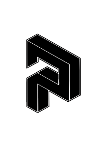
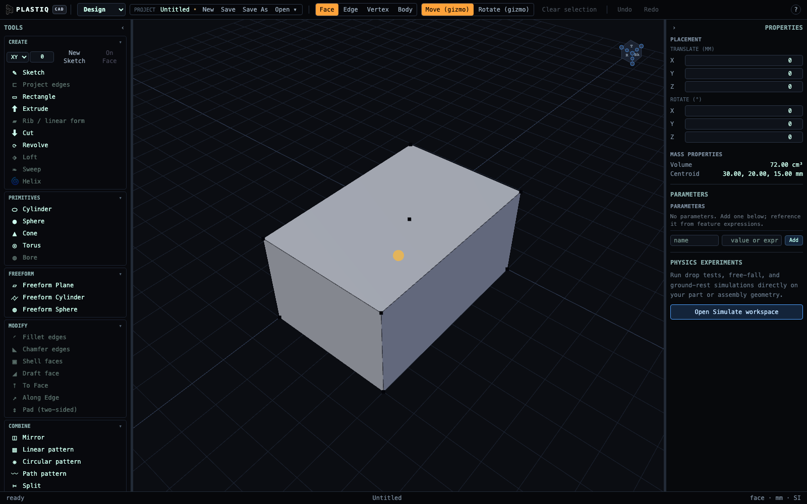
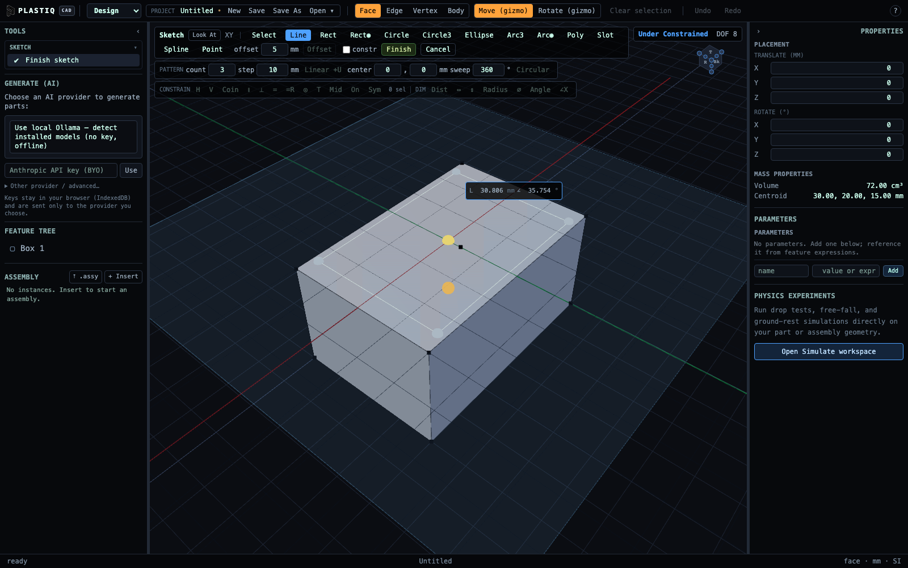
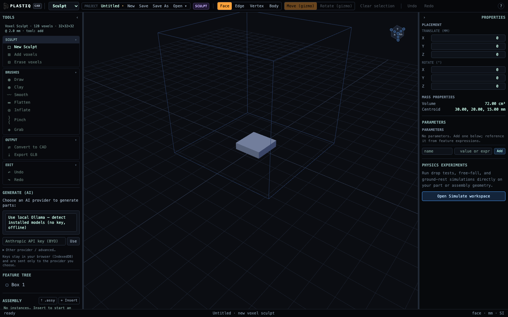

# Plastiq CAD Studio

<p align="center">
  
</p>

<p align="center">
  <strong>Local-first parametric CAD, freeform modeling, assemblies, simulation, and scan-to-CAD in one studio.</strong>
</p>

**Plastiq** is a browser-native CAD studio: feature-based solid modeling on a real B-rep kernel, not a mesh sandbox with CAD branding. It ships in the browser and as a thin native desktop shell (Tauri) around the same app.

The intent is to own the full design loop on the client. Sketches, ordered feature history, assemblies, physics simulation, voxel sculpting, and project storage all run locally — Open CASCADE for solids, FreeCAD’s PlaneGCS for constraints, and interchangeable in-browser physics engines. No modeling server is required. The same serializable feature document the UI builds by hand is what AI generation authors and edits, so a prompt produces geometry you can still dimension, suppress, and rebuild — not a frozen blob you throw away. Organic form and the physical world enter through mesh and capture paths; optional self-hosted services (reconstruction, NURBS fitting, photogrammetry, NeRF, scan completion) turn those into STEP that re-enters the parametric history.

Local-first is the architecture, not a marketing line. Your geometry never leaves the machine for ordinary CAD work. Language models and paid cloud 3D generators are bring-your-own: they are called only when you configure them, and billable mesh jobs always require confirmation first.

---

## The studio



<table>
  <tr>
    <td width="50%"></td>
    <td width="50%"></td>
  </tr>
  <tr>
    <td align="center"><strong>Constrained sketching</strong></td>
    <td align="center"><strong>Voxel sculpting</strong></td>
  </tr>
</table>

These are reproducible captures of the real running application. Start the editor on port 4177, then run `pnpm capture:readme` to refresh them through Playwright.

---

## Workspaces

The top bar switches four workspaces. Each reconfigures the left tool ribbon.

| Workspace | What you do |
| --- | --- |
| **Design** | Sketch profiles, build an ordered feature history, dress up solids, import/export, convert mesh/cloud → CAD |
| **Assemble** | Insert instances, apply mates, explode, check interference, bill of materials |
| **Simulate** | Drop the assembly into a real physics engine under gravity (or zero-g) |
| **Sculpt** | Paint a dense voxel grid, export mesh, or hand off to Convert-to-CAD |

---

## Features & capabilities

### Parametric solid modeling

Plastiq is not a one-shot mesh editor. Parts are an **ordered feature tree** that rebuilds deterministically through Open CASCADE (OCCT) in a Web Worker.

**Create from sketches**

| Tool | What it does |
| --- | --- |
| **Extrude** | Pads a closed profile; *join* fuses onto an existing body or *new* replaces it. Without a profile, opens a sketch session first |
| **Cut** | Pockets material; optional two-sided depth |
| **Revolve** | Solids of revolution; optional axis from a selected edge or world axis; join/new |
| **Loft** | Skin through two or more finished sketch profiles (ruled option) |
| **Sweep** | Sweep a profile along a spine (polyline or line/arc path) |

**Modify & dress-up**

| Tool | What it does |
| --- | --- |
| **Fillet** | Edge rounds; supports variable end radius |
| **Chamfer** | Edge breaks; supports two-distance chamfer with a face |
| **Shell** | Hollow with open faces; **inward** or **outward** wall direction |
| **Draft** | Taper faces relative to a pull direction / neutral plane |
| **Extrude to face** | Pad until a target face |
| **Extrude / cut along edge** | Direction from a selected edge |
| **Pad (two-sided)** | Symmetric extrusion both ways |

**Combine & pattern**

- **Mirror** body across a plane (e.g. selected face)  
- **Linear pattern** / **circular pattern** (count, spacing/angle, direction/axis from selection)  
- **Boolean** tools (union / subtract / intersect), including “subtract last sketch” as a solid tool  
- **Transform** with translate/rotate gizmos and placement write-back  

**Feature tree**

- Select, rename, reorder, **suppress / unsuppress**, **roll back** to a feature, delete  
- Rebuild errors surface on the failing feature  
- After Extrude/Cut/Fillet/etc., an **on-canvas gizmo** previews the real solid live — drag or type the value, confirm or cancel  
- **Properties** panel: numeric params (mm/deg display), op (join/new), shell direction, loft/sweep options, attach edge/face refs from selection  
- **Mass properties** (volume, centre of mass) after rebuild  

**Selection & inspect**

- Modes: **face / edge / vertex / body** (keys `1–4`)  
- Multi-select and **Shift-drag box select**  
- GPU colour-id picking for reliable face hits  
- **Measure** two-click distance with ΔX/Y/Z  
- **Section analysis** — clip with a draggable plane  
- **View cube** + named views (top/front/iso/…)  
- Orbit / pan / zoom; **fit to view**  
- **Ring context menu** (right-click) — selection-aware actions for create, modify, sketch constraints, mates, sim, danger  

---

### Constrained 2D sketching

Open a sketch on **XY / XZ / YZ**, an offset plane, or **on a picked face**. The FreeCAD **PlaneGCS** solver (WASM) runs on the main thread with live under- / well- / over-constrained feedback.

**Draw tools**

Select · Line · Rectangle · Center rectangle · Circle · 3-point circle · Arc · Center arc · Polygon · Slot · Spline · Point  

- **Construction** geometry (toggle `X`) — excluded from the solid profile  
- Drag-to-draw with live previews  
- **Precise typed input** — length/angle for lines, width×height for rects, radius for circles, absolute coordinates  
- Snap / inference (reuse points, horizontal/vertical)  
- Letter-key tool shortcuts; **D** smart dimension  

**Constraints**

Horizontal · Vertical · Coincident · Parallel · Perpendicular · Equal length · Concentric · Tangent · Midpoint · Point on object · Symmetric · Fix / unfix point  

**Dimensions**

Distance · Horizontal distance · Vertical distance · Radius · Diameter · Angle  

Finish only when a **closed profile** can be extracted. Sketch undo is local to the session and separate from the document history.

---

### Assemblies

- **Insert instance** of the open part (multiple occurrences of the same feature tree)  
- **Mate mode** — pick two instance faces and apply:  
  **coincident · concentric · parallel · perpendicular · distance · angle**  
- Ground an instance as **fixed**  
- **Exploded view** (factor slider)  
- **Interference check** (bounding-box broad phase — clearance for non-overlapping layouts)  
- **Bill of materials** rolled up from a declarative assembly document  
- Import / export **`.assy`** JSON (sub-assemblies; cycles rejected)  
- Design-time **joints** (revolute, prismatic, cylindrical, fixed, ball, planar) lower into simulation  

> Instances share the open part’s geometry (a multi-part component library is not shipped yet). Joint drives preview motion independently, not as full chained kinematics.

---

### Physics simulation

Switch to **Simulate** — the assembly lowers to a `SimManifest` and steps under a real engine in the browser. Simulation is **view-only**; return to Design restores the untouched model.

**Engines** (pick at runtime)

| Backend | Notes |
| --- | --- |
| **MuJoCo** | Default — DeepMind WASM |
| **Rapier** | `@dimforge/rapier3d-compat` |
| **ammo.js** | Bullet |
| **cannon-es** | Lightweight |

- Bodies as **compounds of convex hulls**; concave parts split with **V-HACD** so colliders follow pockets  
- Joints: hinge, slider, cylindrical, ball, planar, fixed — unsupported combinations **throw** rather than silently mis-simulate  
- Playback: pause / resume, step one frame, rewind to spawn, stop  
- **Experiments**: drop-test, free-fall, rest on ground, zero-g; gravity scale (Earth / Moon / Mars / 2g); drop height; optional ground slab  
- Live telemetry (speeds, heights, settled)  
- Fixed 120 Hz tick, deterministic seed  

---

### Voxel sculpting

- New default **32³** grid (2 mm voxels) with a starter slab  
- **Add** / **Erase** by click (Alt inverts per click)  
- SDF brushes: **Draw · Clay · Smooth · Flatten · Inflate · Pinch · Grab**  
- Sculpt-local undo / redo  
- **Export GLB** of the surface mesh  
- **Convert to CAD** stages a mesh document for reconstruct / NURBS (original voxels kept)  

---

### AI generation

Describe a part (or attach a drawing). A tool-using agent authors a real **parametric feature document** (mm/deg) that becomes the live editable model.

| Agent tool | Role |
| --- | --- |
| `plan_part` | Decompose complex objects into a part graph before building |
| `build_part` | Validate and apply an authoring document → live CAD |
| `inspect_geometry` | List faces/edges (normals, areas) so dress-ups target correctly |
| `answer_user` | Finish with a short user-facing summary |
| `create_mesh` | **Paid** cloud 3D gen (text/image → mesh) — confirm modal first |
| `reconstruct_brep` / `fit_nurbs` | Local mesh → editable STEP (when services run) |
| `cloud_to_mesh` / `complete_scan` | Local point cloud → mesh |

**Providers (bring your own)**

| Provider | Needs key | Notes |
| --- | --- | --- |
| **Ollama** (local) | No | Offline; first-run *detects* installed models |
| **llama-mlx** (Apple Silicon) | Keychain-style key | Local MLX server |
| **Anthropic Claude** | Yes | Opus / Sonnet / Haiku catalog |
| **OpenAI-compatible** | Optional | Any `/v1` endpoint or hosted proxy |

**Surfaces:** **Generate (AI)** side panel (streaming transcript, tool trace, usage meter, cancel) and **⌘/Ctrl-K** command palette (prompt + action search). Conversation history is **per project**.

**Creative mesh (paid, fal.ai)** — after confirm:

- 3D: Tripo v2.5, Meshy v6, Hunyuan3D v2  
- Text→image stage: FLUX schnell (default), FLUX dev, Fast SDXL  

Generated meshes open as mesh documents and can convert to B-rep when reconstruct or NURBS is running.

**Headless:** `plastiq-gen` CLI — description (± drawing) → STEP against any OpenAI-compatible model (used by CADGenBench).

---

### Real-world capture → editable CAD

Optional **self-hosted** services (primarily **Apple Silicon / MLX** for the ML paths; reconstruct/NURBS STEP use **pythonOCC**):

```text
Unposed photos
    → Photogrammetry (:8004)  poses + sparse/dense oriented clouds
        ├→ NeRF / VolSDF (:8002)  posed images → mesh
        └→ Capture (:8001)        cloud / depth / partial scan → mesh
              └→ Reconstruct (:8000)  or  Fit NURBS (:8003)
                    └→ STEP → import as editable parametric CAD
```

| Service | Port | You give it | You get |
| --- | --- | --- | --- |
| **Photogrammetry** | 8004 | ≥3 unposed photos | Camera poses (`transforms.json`), sparse + dense PLY |
| **NeRF** | 8002 | Posed images + transforms | Mesh (VolSDF/NeuS default, or vanilla NeRF) |
| **Capture** | 8001 | Oriented points, depth map, or partial scan | Watertight mesh; shape **completion** for incomplete scans |
| **Reconstruct** | 8000 | Mesh (GLB) | Mechanical-friendly B-rep **STEP** (analytic primitives → CSG → fitted freeform → faceted fallback) |
| **NURBS** | 8003 | Organic / freeform mesh | Smooth NURBS patches → **STEP** (open disk or closed genus-0) |

In-app panels: Mesh convert, NeRF capture, Photo solve (handoff to NeRF or capture), Point-cloud scan. Ribbon actions **Reconstruct / Fit NURBS / To Mesh / Complete** when the right document kind is open.

**Canvas drop:** drop ≥3 photos → photogrammetry dense cloud; drop `.ply` / `.xyz` / `.json` → point-cloud project.

`pnpm dev` starts and supervises all five services with the editor. The first run creates any
missing conda environments. Use `just services` only for a service-only session and
`just services-stop` to stop supervisor-owned fleets; healthy services that were already running
are adopted and never terminated. Base URLs and optional deployment API keys live in Settings.

---

### Mesh documents

- Import **glTF/GLB** as non-parametric mesh bodies  
- Select mesh entities; transform; clone selection  
- Export mesh **GLB**; convert to CAD via reconstruct / NURBS  

---

### Import & export

| Format | In | Out | Notes |
| --- | --- | --- | --- |
| **STEP** | ✓ | ✓ | B-rep exact via OCCT; large imports (≥8 MB) warn about recovery storage |
| **IGES** | — | ✓ | OCCT writer |
| **glTF** | mesh path | ✓ | Parametric export is glTF JSON from tessellation |
| **GLB** | mesh path | mesh/voxel | Binary mesh handoff |
| **`.assy`** | ✓ | ✓ | Declarative assembly + BOM |
| **Point clouds** | ✓ | — | PLY (ASCII) / XYZ / JSON |
| **Photos** | ✓ | — | Drop or panel → photogrammetry / NeRF |

---

### Projects, save, recovery

- In-browser **SQLite** (sql.js) project list with thumbnails, rename, delete  
- Document kinds: parametric CAD · mesh · voxel · point cloud (one project = one kind)  
- **Autosave** (~1.5 s) for named projects; **crash-recovery** snapshots (~0.5 s) for unsaved work  
- Recover / Discard banner after a hard reload  
- **⌘/Ctrl-S** save  
- Needs WebGL2, WebAssembly, writable localStorage, IndexedDB (friendly screen if missing)  

---

### Desktop app

[`apps/desktop`](apps/desktop) — **Tauri 2** native window around the same web editor (no separate frontend). Platform installers via `pnpm -C apps/desktop build`. No custom native file APIs yet — the product is the web app hosted natively.

---

## Technology

| Concern | Implementation |
| --- | --- |
| UI | React 19, Zustand, Tailwind CSS 4, three.js, React Three Fiber / Drei |
| CAD kernel | `@plastiq/cad` — Open CASCADE via trimmed **opencascade.js** WASM (~5.6 MB gzip) |
| Sketch | FreeCAD **PlaneGCS** (`@salusoft89/planegcs`) |
| Assembly mates | First-party Levenberg–Marquardt 3D mate solver |
| Physics | `@plastiq/sim` — MuJoCo, Rapier, ammo.js, cannon-es |
| Convex hulls | V-HACD WASM for concave colliders |
| Context UI | `@plastiq/recm` — ring-expanding radial menus in the 3D viewport |
| Persistence | sql.js + IndexedDB + localStorage recovery |
| AI | Tool-calling agents; Zod authoring schema; Anthropic / OpenAI-compatible / Ollama / llama-mlx |
| Geometry thread | Web Worker: rebuild, tessellate (tagged face/edge refs), sim lower, STEP/IGES/glTF export |
| Selectors | Named geometric predicates (`topFace`, `convexEdges`, `filletChain`, …) so AI dress-ups track rebuilds |
| Optional ML | FastAPI + **MLX** (Apple Silicon) for capture / NeRF / NURBS / photogrammetry; **pythonOCC** for STEP solids |
| Desktop | Tauri 2 |
| Tooling | pnpm monorepo, Vite 8, TypeScript, Vitest, Playwright (no-mock E2E) |

Single-threaded WASM only — **no COOP/COEP** headers required. Any static host can serve the app.

```text
Browser / Desktop (Tauri)
├── React UI · ribbon · RECM menus · AI panel
├── Main thread: sketch solver (planegcs), three.js, physics step
└── Geometry worker: OCCT rebuild · tessellation · export · sim lower
        │
        │ optional HTTP (localhost)
        ▼
services/:  reconstruct:8000 · capture:8001 · nerf:8002 · nurbs:8003 · photogrammetry:8004
```

---

## Getting started

### Requirements

- Node.js ≥ 20, pnpm 10  
- Current Chrome, Edge, Firefox, or Safari with WebGL2  
- Optional: Rust (desktop), mamba/conda + Apple Silicon (ML services)  

### Run the editor

```bash
pnpm install
pnpm dev                 # services :8000–:8004 + editor http://localhost:5173
# or: just dev
```

### Build & self-host

```bash
pnpm build               # apps/plastiq/dist
just app-docker-build    # nginx image with wasm MIME + precompressed assets
just app-docker-run      # http://localhost:8080
```

Details: [`docs/deploy.md`](docs/deploy.md).

### Desktop

```bash
pnpm -C apps/desktop dev
pnpm -C apps/desktop build
```

### Optional services

```bash
just services            # service-only supervisor for all five on :8000–:8004
just services-stop       # stop only Plastiq-owned service fleets
```

### Develop

```bash
just test                # Vitest (real OCCT + wasm)
just e2e                 # Playwright, real browser, no mocks
just typecheck
just lint
```

---

## Repository layout

```text
apps/plastiq              Web CAD studio (the product)
apps/desktop              Tauri shell
packages/cad              B-rep kernel, sketch, mates, sim lowering
packages/sim              Physics backends
packages/recm             Ring context menus
packages/recon|capture|nerf|nurbs|photogrammetry
                          Browser clients for optional services
services/*                Python FastAPI services (ports above)
e2e/plastiq               Playwright journeys (sketch→solid, sim backends, AI, services, …)
benchmark/harness         CADGenBench evaluation (headless AI → STEP)
deploy/plastiq-web        Static nginx Docker image
docs/specs|adr|plans      Specs and architecture decisions
```

Empty scaffolds (not product surface): `packages/{data,embed,ml,rl,segment}`.

---

## Benchmarking

AI generation is scored against [CADGenBench](https://huggingface.co/spaces/HuggingAI4Engineering/CADGenBench) via [`benchmark/harness/`](benchmark/harness/) (`plastiq-gen` headless). Local/manual — not push CI. See that README and `just bench-*`.

---

## License

First-party code: **PolyForm Noncommercial License 1.0.0** ([`LICENSE`](LICENSE)) — free for noncommercial use; commercial rights reserved by LayerDynamics.

Third-party: OCCT / planegcs (LGPL), MuJoCo (Apache-2.0), V-HACD (BSD-3-Clause), and other MIT/Apache runtimes — see [`THIRD-PARTY-NOTICES.md`](THIRD-PARTY-NOTICES.md).
